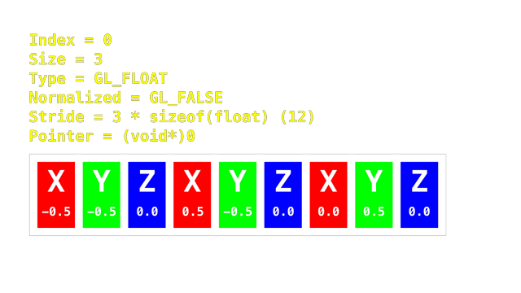

# Piggo's OpenGL 3.3 Tutorial In C

I found LearnOpenGL a bit difficult to understand at times and so did one of my friends so I am effectively flipping the content of that here, hopefully in an easier to understand manner. I believe C is a simpler language than C++ and is better for explaining to beginners.

## Who this is for
If you want to write a game engine, this tutorial will teach you one part (the most important, rendering) of how to make a game engine. With that said, I underestimated how easy the rendering part is compared to the actual engine itself. Not to say that you will too, but it's something to keep in mind.

Of course you can make any sort of 3D application using OpenGL, but it is primarily geared toward realtime rendering.

Computers are far more powerful than people think, nowadays it is the programmer that is the bottleneck not the machine itself. Even with OpenGL, a very old API which some call deprecated (although I strongly disagree with that) it can still push many thousands of frames per second on fairly complex scenes. And that's without any optimizations such as occlusion culling and LOD.

> "B-but why not Vulkan!!!?1/!"

Vulkan is good in the right hands, but more of a GPU API than a graphics API. Over 1000 lines of code are needed to draw a triangle to the screen, most of which are setting very obvious parameters. On a more opinionated note, Vulkan's supposedly superior performance can only really be attained if the programmer knows what he is doing very well. Gamers often complain about poorly optimized Vulkan renderers, and I think this is mainly due to control (to optimize) being taken away from the driver developer, someone who knows the hardware inside out and given to the game engine developer, who just wants to draw [a god dang hot-dog](https://youtube.com/watch?v=EvKTOHVGNbg).

## Expectations
- You should be somewhat familiar with C. If you aren't I made a tutorial for that [here](replaceme)!
- You should also have a computer (duh). I only know Windows and Linux well, so I can't offer support well for MacOS or any other OS (except maybe BSD). Later on, everything should be quite platform independent anyway.

## What OpenGL is and what it isn't
OpenGL, being a low level library doesn't do anything in the way of game logic, window management, sound, even perspective 3D rendering and other transformations. **OpenGL's sole purpose is to take geometry from you, the programmer and turn it into pixels on the screen.**

The way OpenGL does this is via a process called rasterization. A specialized part of your GPU known as the rasterizer acts the same as those connect-the-dots puzzles you might have done as a kid. A series of points (vertices) is given, the area inside of the shape is identified and then colored in. In OpenGL, the vertex positions are defined by the vertex shader and the pixel colors are defined by the fragment shader. Fragment is mostly interchangeable with pixel. In DirectX, another graphics API they are just called pixel shaders.

> "But if it doesn't manage windows or anything else, how do we even use it?"

You could use your operating system's native APIs such as Win32 but if your end goal isn't to write [a 4kb demo](https://youtube.com/watch?v=jB0vBmiTr6o) you probably don't want that!

In this tutorial we will be using the libraries GLFW and GLAD. GLFW is what manages the window and inputs (mouse, keyboard, controller) and some other things. GLAD gets the memory addresses of the driver's OpenGL functions so we can use them.

The reason GLAD needs to exist is because **every driver is different**. The vendor (company that made your GPU and its driver) has its *own* implementation of OpenGL. It follows the same **specification** as all of the other GPU manufacturers, so software doesn't have to be rewritten for every single GPU model. However, the driver binary for interfacing with the GPU itself is always going to be different, so function locations in memory of one driver won't line up with another.

If we **didn't** use GLAD, we would have to ask the driver for every function location **manually**.

```c
// This example is for GLX. It is how you do OpenGL on Linux systems running X11
typedef void (*GLBindVertexArrayFunc)(GLuint array);
GLBindVertexArrayFunc glBindVertexArray;
glBindVertexArray = (GLBindVertexArrayFunc)glXGetProcAddress((const GLubyte*)"glBindVertexArray");
```
*(Don't actually copy paste this!)*

As you can imagine, this is very cumbersome considering you'll need at least 20 functions.

## How OpenGL works
OpenGL objects are used to store data. They are referenced by a numerical ID, but you can ignore this.

```c
int vbo;
glGenBuffers(1, &vbo); // We are going to make only 1 buffer and say we want the ID written to the pointer of the `vbo` int

// Now that we have a VBO, let's bind to it so that OpenGL knows this is the buffer we are currently using
glBindBuffer(GL_ARRAY_BUFFER, vbo); // OpenGL doesn't know that this new buffer is intended for vertices yet. We tell it here. No pointer needed this time as we can only bind one buffer at a time
```

The graphics driver created a Buffer Object and assigned it an ID. It was bound as an array buffer, to be used for storing vectors (the positions of each vertex) and other info such as normals and texture coordinates. We call this a VBO

## How a simple 3D OpenGL usecase works
1. Create a window
2. Get function pointers
3. Load a 3D model and store it in memory as an array of vec3 (vertex positions)
4. Create a VBO or Vertex Buffer Object (buffer stored in GPU VRAM)
5. Load the vertices from earlier into the VBO
6. Create a VAO or Vertex Array Object to let OpenGL know how to interpret the VBO's data
7. Compile shaders
8. Bind shaders
9. Set projection, view and model matrices in the shader
10. Draw

This may seem complex at first, but this is the basis of how everything is done in OpenGL. Once you understand the basics, the things you can do are pretty much endless

## Getting started

### Initial setup

#### Windows
I am not sure. Refer elsewhere

#### MacOS
I am not sure. Refer elsewhere

#### Linux
This depends on your distro, but it's typically quite straight forward. Use your package manager to install glfw and if you don't have it already, a C compiler such as `gcc`, `clang` or `tcc`. I use `gcc` because it is typically the most popular and well supported. It is likely your package manager offers GLFW, so search for it. On some distros, you may need a "dev" version of the package. This contains headers and other things you will need for making your own programs with it.

### GLAD
As mentioned before, we will need this to get the GL function pointers. You can't just get this from your package manager though, as different users will need different versions of it. Either go to [this site](https://glad.dav1d.de/) and follow the instructions below or download [mine](replaceme).

On the GLAD generator:
1. Set the "gl" dropdown to "Version 3.3"
2. Set the "Profile" dropdown to "Core"
3. Scroll down and click the "Generate" button.
4. Click & download "glad.zip" from the directory listing

Now we have glad.zip, extract the "include" folder and place it in your project folder. Also place glad.c from the src folder into the project folder.

### Testing to see if everything is working
#### Code
In the project folder, create a file named **main.c** and copy this into it

```c
#include <glad/glad.h>
#include <GLFW/glfw3.h>
#include <stdio.h>

int main() {
    glfwInit();
    glfwWindowHint(GLFW_CONTEXT_VERSION_MAJOR, 3);
    glfwWindowHint(GLFW_CONTEXT_VERSION_MINOR, 3);
    glfwWindowHint(GLFW_OPENGL_PROFILE, GLFW_OPENGL_CORE_PROFILE);

    GLFWwindow* window = glfwCreateWindow(1280, 720, "Window", NULL, NULL);
    if (window == NULL) {
        printf("Failed to create GLFW window\n");
        glfwTerminate();
        return 1;
    }
    glfwMakeContextCurrent(window);
    if (!gladLoadGLLoader((GLADloadproc)glfwGetProcAddress)) {
        printf("Failed to load function pointers\n");
        glfwTerminate();
        return 1;
    }
    glfwTerminate();
    return 0;
}
```

#### Build
You can either use CMake or compile the good old-fashioned way. CMake is useful for large projects but can be quite annoying so I'll leave it up to you to decide.

CMake:
1. Create a file named CMakeLists.txt in the project folder and put this into it:
```
cmake_minimum_required(VERSION 3.0.0)
project(projectnamehere VERSION 0.1.0 LANGUAGES C)

include(CTest)
enable_testing()

include_directories(include)

add_executable(main main.c glad.c)
target_link_libraries(main glfw)
```
2. Create a folder named "build" (it doesn't have to be called that)
3. From the build directory run `cmake ..`
4. Assuming there were no errors, you can now run `make`. It is possible that `ninja` was used instead if it is installed, so you can try that too.

Using the compiler directly:
1. Run this command from the project folder (depending on the compiler you are using):
`gcc main.c glad.c -Iinclude -lglfw -lm -o main`
2. Profit?

Either if successful should create an executable named `main`. Run it. You might briefly see a window appear. This is because we create a window, but immediately terminate GLFW afterwards, therefore destroying the window. If there are no errors printed, you should be good to go.

### Keeping a window open
Let's break down the test code from before.

Here is the code again explaining everything in comments

```c
// It is important to include GLAD and then GLFW, not the other way around. You can bypass this restriction however by using the flag `#define GLFW_INCLUDE_NONE`. This might become helpful in larger projects with lots of files.
#include <glad/glad.h>
#include <GLFW/glfw3.h>
#include <stdio.h>

int main() {
    glfwInit(); // Initialize the GLFW library so we can use it
    glfwWindowHint(GLFW_CONTEXT_VERSION_MAJOR, 3); // Tell GLFW that when we create a window we want OpenGL version 3
    glfwWindowHint(GLFW_CONTEXT_VERSION_MINOR, 3); // We want OpenGL version 3.3. 3.X is defined here
    glfwWindowHint(GLFW_OPENGL_PROFILE, GLFW_OPENGL_CORE_PROFILE); // Use the core profile, we don't need the legacy functions from compatability.

    GLFWwindow* window = glfwCreateWindow(1280, 720, "Window", NULL, NULL); // Create a window. Window width of 1280 pixels, window height of 720 pixels, window title. You can ignore the last 2 arguments, refer to the GLFW docs if you need them
    if (window == NULL) { // If the function returned NULL, it wasn't successful. Throw an error and quit
        printf("Failed to create GLFW window\n");
        glfwTerminate();
        return 1; // Something went wrong, let the shell/OS know
    }
    glfwMakeContextCurrent(window); // Tell GLFW this is the window we want the OpenGL context bound to
    if (!gladLoadGLLoader((GLADloadproc)glfwGetProcAddress)) { // Load the function pointers using GLAD
        printf("Failed to load function pointers\n");
        glfwTerminate();
        return 1;
    }
    glfwTerminate(); // Let GLFW clean up before quitting
    return 0; // No errors, let the shell/OS know
}
```

To keep the window open, it's not a good idea to do something in the meantime (such as sleep()ing) and ignore the window. If the OS sees a window that is not looking for inputs regularly, it will assume that the program is not responding. Instead, we need a draw loop. This draws every frame and handles inputs.
After the function pointers are loaded, add this while loop:

```c
while (!glfwWindowShouldClose(window)) { // While the window should not close (user isn't trying to close the window), do this
    glfwSwapBuffers(window); // There are 2 buffers. The one that is being currently drawn to, and the one displayed by the window. This is done to prevent a not yet drawn frame from being displayed. This function swaps the pointers, making the newly drawn frame visible.
    glfwPollEvents(); // Handle inputs
}
```

Compile the program again and run it. Now you should see either a black window or a seizure-inducing mess. If it's the latter, first, sorry and also that means your graphics driver doesn't initialize VRAM before giving it to the user. You might see fragments of recently running programs in there, even textures from other 3D applications. Either way, we should clear the buffer before displaying it.

Before swapping the buffers we set the color GL should clear with as `glClearColor(0.25, 0.25, 0.25, 1.0);`. These are RGBA values, but like the normalized device coordinates, these aren't what you're most likely used to. Instead of going from 0-255, each channel goes from 0-1, but floating point so we can have a decimal point instead of an 8-bit integer. On most displays, this value will be converted to 0-255 anyway. We still haven't cleared the window yet though, let's run `glClear(GL_COLOR_BUFFER_BIT);` afterwards. You might be wondering what the argument is, that's because glClear can clear framebuffers other than the regular color one. We will use the depth buffer later on for 3D rendering.

When compiling & running the resulting code, you should see a boring grey window. If you don't, here's what the while loop should look like at this point:

```c
while (!glfwWindowShouldClose(window)) {
    glClearColor(1.0, 1.0, 0.0, 1.0);
    glClear(GL_COLOR_BUFFER_BIT);
    
    glfwSwapBuffers(window);
    glfwPollEvents();
}
```

### Rendering a triangle
With everything that we have learned, it's finally time to put it to use.


#### Loading geometry
Of course, to render a triangle we need the vertices for a triangle.

```c
float triverts[] = {
    -0.5f, -0.5f, 0.0f,
    0.5f, -0.5f, 0.0f,
    0.0f,  0.5f, 0.0f
};
```

We will create a VRAM buffer for the triangle vertices and a VAO (before the main loop):
```c
int triVBO, triVAO;
glGenBuffers(1, &triVBO);
glGenVertexArrays(1, &triVAO);
```
Bind to them:
```c
glBindBuffer(GL_ARRAY_BUFFER, triVBO);
glBindVertexArray(triVAO);
```
Load the vertex data:
```c
glBufferData(GL_ARRAY_BUFFER, sizeof(triverts), triverts, GL_STATIC_DRAW);
```
Now, for each piece of data in the VBO, we need to tell the VAO so GL knows what to give the shaders.
```c
glVertexAttribPointer(0, 3, GL_FLOAT, GL_FALSE, 3 * sizeof(float), (void*)0);
glEnableVertexAttribArray(0);
```
I feel like `glVertexAttribPointer` needs a bit more explaining.
```
glVertexAttribPointer(
    Index - used in the vertex shader later on as a location or ID for this vertex attribute,
    Size - this is the size as a multiple of the size of whatever type it is,
    Type - this is the type mentioned above, GL_FLOAT is 4 bytes, same as the regular float,
    Normalized - no need to worry about this for now,
    Stride - the amount that OpenGL reads forward in the buffer for the next one of *this* attribute
    Pointer - offset from the beginning of the buffer, for example after a position vector that is 12 bytes long, we want to read 3 * sizeof(float) ahead
)
```
Here is a diagram:



We then enable this new vertex attribute with `glEnableVertexAttribArray`.

#### Shaders
OpenGL shaders are written in a language similar to C called GLSL. Although it is similar, some features are missing. You cannot allocate memory at runtime, there is no logging function (eg: printf()). There are two types, the vertex shader and the fragment shader. Vertex shaders run for every vertex, fragment shaders run for every pixel. Most commonly, vertex shaders translate the model's vertices, and the fragment shader calculates lighting per pixel.

For the vertex shader, we will take the data from the VBO we made earlier. Create a file named `shader.vs` with these contents:
```glsl
#version 330 core // Define the GLSL version as 330, looks similar to 3.3 right? We are using the core profile so we put that too

layout (location = 0) in vec3 vPos; // Get the vertex position from the VBO with the index of 0 (currently the only one)

void main() { // Main function just like in C, but in GLSL main functions don't return a value
    gl_Position = vec4(vPos, 1.0); // Convert the (x, y, z) to (x, y, z, w). This vec4 version is called a homogenous coordinate. I will explain why they are useful later!
}
```

In this shader that runs 3 times in our case (once for each vertex) we will simply send the same position as was specified in the VBO to the rasterizer as the gl_Position variable. Later on, this shader is where the perspective calculations that make 3D possible will happen.

Next comes the fragment shader. It looks a bit different, but mostly the same.

```glsl
#version 330 core

// Later on we can get data from the vertex shader from here, which comes before the fragment shader.

out vec4 fragColor; // RGBA in the same format as glClearColor(). 0.0 to 1.0, with 0.0 being the darkest and 1.0 being the brightest (low dynamic range). HDR or high dynamic range does not have this limit

void main() {
    fragColor = vec4(0.19, 1.0, 0.66, 1.0); // A turquoise-like color
}
```

This fragment shader makes every pixel inside of the geometry's bounds turquoise

OpenGL compiles both the vertex and fragment shader into a "shader program" which is used when drawing. First, we have to compile both shaders individually, then we link them to make a shader program.
Well this is nice and all but we still don't have a way to load the shaders from a file into our program. Thanks to the standard C library, this is quite easy. Let's create a struct to hold information about our shader.

```c
struct ShaderProgram {
    int id; // Object ID for the shader program
};
```

It would make a bit more sense if the struct had more than one member, but oh well.

Now we need some functions to use this struct, sorry about this block being massive:
```c
#include <stdlib.h> // We need a new header for malloc()!

int programFromShaderPaths(struct ShaderProgram* ptr, const char* v_shader_path, const char* f_shader_path) {
    // Error handling definitions
    int success; // 0 = fail, 1 = success
    char infoLog[4096]; // Log for the compiler & linker so we can see if something goes wrong

    // Check for the shader program pointer being NULL to avoid a segfault
    if (ptr == NULL) {
        printf("null ptr given\n");
        return 1;
    }

    // Load & compile vertex shader
    FILE* fp = fopen(v_shader_path, "r"); // Use fopen to read ("r") the vertex shader file
    if (fp == NULL) { // if the file could not be opened
        printf("Could not open the vertex shader file with path '%s'\n", v_shader_path);
        return 1;
    }
    fseek(fp, 0L, SEEK_END); // Seek (reading offset) to the end of the file
    size_t sz = ftell(fp); // Get the offset from the beginning of the file. Because we are at the end of the file this is the file size in bytes
    rewind(fp); // Move the offset back to the beginning of the file so we can read it
    char* v_shader_src = malloc(sz+1); // Allocate enough memory to store the file and the terminating null byte
    v_shader_src[sz] = '\0'; // set the last byte to null so that C knows where the end of the string is
    if (v_shader_src == NULL) { // if malloc failed to get the memory
        printf("failed to allocate memory!\n");
        return 1; // Exit code for failure
    }
    fread(v_shader_src, sz, 1, fp);
    fclose(fp); // Close the file handle, we no longer need it
    unsigned int v_shader_obj = glCreateShader(GL_VERTEX_SHADER); // Create the vertex shader's GL object
    glShaderSource(v_shader_obj, 1, (char const* const*)&v_shader_src, NULL);
    glCompileShader(v_shader_obj);
    glGetShaderiv(v_shader_obj, GL_COMPILE_STATUS, &success); // Was it successful?
    if (!success) { // If we weren't...
        glGetShaderInfoLog(v_shader_obj, 4096, NULL, infoLog); // Get the compiler log
        printf("Vertex shader compilation failed: \n%s\n", infoLog); // Print it
        return 1;
    } // Just continue otherwise, no reason to get the log

    // Load & compile fragment shader
    fp = fopen(f_shader_path, "r"); // Use fopen to read ("r") the vertex shader file
    if (fp == NULL) { // if the file could not be opened
        printf("Could not open the fragment shader file with path '%s'\n", f_shader_path);
        return 1;
    }
    fseek(fp, 0L, SEEK_END); // Seek (reading offset) to the end of the file
    sz = ftell(fp); // Get the offset from the beginning of the file. Because we are at the end of the file this is the file size in bytes
    rewind(fp); // Move the offset back to the beginning of the file so we can read it
    char* f_shader_src = malloc(sz+1); // Allocate enough memory to store the file and the terminating null byte
    f_shader_src[sz] = '\0'; // set the last byte to null so that C knows where the end of the string is
    if (f_shader_src == NULL) { // if malloc failed to get the memory
        printf("failed to allocate memory!\n");
        return 1; // Exit code for failure
    }
    fread(f_shader_src, sz, 1, fp); // Read the file contents into the buffer malloc made
    unsigned int f_shader_obj = glCreateShader(GL_FRAGMENT_SHADER); // Create the fragment shader's GL object
    glShaderSource(f_shader_obj, 1, (char const* const*)&f_shader_src, NULL); // Load the source from the file into it
    glCompileShader(f_shader_obj); // Compile the shader
    glGetShaderiv(f_shader_obj, GL_COMPILE_STATUS, &success); // Was it successful?
    if (!success) { // If we weren't...
        glGetShaderInfoLog(f_shader_obj, 4096, NULL, infoLog); // Get the compiler log
        printf("Fragment shader compilation failed: \n%s\n", infoLog); // Print it
        return 1;
    } // Just continue otherwise, no reason to get the log

    // Create and link the shader program
    unsigned int shaderProgram = glCreateProgram(); // Create the shader program object
    glAttachShader(shaderProgram, v_shader_obj); // Attach the vertex shader to this program
    glAttachShader(shaderProgram, f_shader_obj); // Attach the fragment shader to this program
    glLinkProgram(shaderProgram); // Link the two compiled shaders into one program
    glGetShaderiv(f_shader_obj, GL_COMPILE_STATUS, &success); // Was it successful?
    if (!success) { // It was not...
        glGetShaderInfoLog(f_shader_obj, 4096, NULL, infoLog); // Get the linker log
        printf("Shader program linking failed: \n%s\n", infoLog);
        return 1;
    } // It was!
    ptr->id = shaderProgram;
    
    // Cleanup before exiting
    glDeleteShader(v_shader_obj);
    glDeleteShader(f_shader_obj);
    free(v_shader_src);
    free(f_shader_src);

    return 0; // Exit code for success
}
void useShader(struct ShaderProgram* ptr) {
    glUseProgram(ptr->id);
}
```

Now that we have a way to load & compile shaders, let's implement it. After loading the geometry:

```c
struct ShaderProgram shader;
if (programFromShaderPaths(&shader, "./shader.vs", "./shader.fs")) {
    printf("Failed to load shader!\n");
    return 1;
}
```

#### Finishing up

As I'm sure you'll be glad to hear, we are now finally ready to draw our first triangle (hopefully first of many) to the window.

In the drawing loop between the clear and buffer flip/poll for input functions we first need to bind to the mesh VAO.
```c
glBindVertexArray(triVAO);
```
Then, we use the shader:
```c
useShader(&shader);
```
and draw!
```c
glDrawArrays(GL_TRIANGLES, 0, 3);
```
If you were paying close attention, you might have realized that we didn't bind to the VBO. This is because the VAO is implicitly attached to the VBO, and binds it automatically.

Rerun the program, and you should see a turquoise triangle. There are many opportunities to go wrong here, so don't feel too bad if it doesn't work first try.